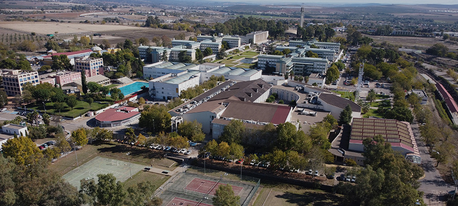
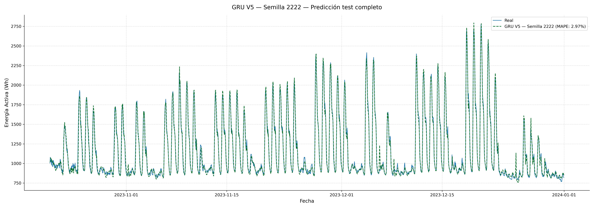

# UCO Electricity Prediction



Predicción horaria del consumo eléctrico del edificio Leonardo Da Vinci (Campus de Rabanales, Universidad de Córdoba) mediante redes neuronales recurrentes GRU y LSTM.

Trabajo Fin de Grado — Grado en Ingeniería Informática  

Autor: Carlos Marín Rodríguez
Director: José Luis Ávila Jiménez


## Estructura del repositorio

- `data/` — Datasets procesados
- `src/` — Código principal del proyecto (preprocesamiento, gráficas y modelos desarrollados)
- `models/` — Modelos entrenados, escaladores por versión, arquitectura y semilla
- `results/` — Resultados de cada modelo (gráficas y métricas de cada modelo)
---

## Metodología

El trabajo evalúa cinco versiones del modelo (V1 a V5) en paralelo sobre dos arquitecturas recurrentes (GRU y LSTM), siguiendo un protocolo de evaluación estocástica con 20 semillas aleatorias independientes. Las métricas reportadas son el MAPE medio, la desviación típica y los valores extremos sobre las 20 ejecuciones.

| Versión | Variables de entrada | Variables |
|---|---|---|
| V1 | Codificación cíclica temporal + is_weekend | 8 |
| V2 | V1 + calendario académico UCO | 11 |
| V3 | V2 + temperatura horaria | 12 |
| V4 | V3 + retardos t-24 y t-168 + indicador festivo t+1 | 15 |
| V5 | V1 + protocolo de entrenamiento refinado | 8 |

---

## Instalación

**1. Clonar el repositorio**
```bash
git clone https://github.com/i02maroc/UCO-electricity-prediction
cd UCO-electricity-prediction
```

**2. Crear el entorno conda**
```bash
# Linux / macOS
conda env create -f environment.yml
```

```bash
# Windows
conda env create -f windows_environment.yml
```

**3. Activar el entorno**
```bash
conda activate electricity-prediction
```

---

## Uso

Los scripts de entrenamiento, evaluación, creación de gráficas y preprocesamiento se encuentran en `src/`. Cada carpeta contiene scripts independientes para GRU y LSTM, así como el script de evaluación completa con las 20 semillas.

Los modelos entrenados, escaladores y resultantes de cada semilla se almacenan automáticamente en `models/vX/gru/semilla` y `models/vX/lstm/semilla`.

---

## Tecnologías empleadas

| Librería | Versión |
|----------|---------|
| Python | 3.10.19 |
| TensorFlow | 2.13.0 |
| Keras | 2.13.1 |
| NumPy | 1.24.3 |
| pandas | 2.3.3 |
| matplotlib | 3.10.6 |
| scikit-learn | 1.7.2 |
| joblib | 1.5.2 |
| SciPy | 1.15.3 |
| Conda | — |
| statsmodels | — |
| Meteostat | — |

---

## Resultados

El modelo final (GRU V5) alcanza un **MAPE medio de 3,32%** (σ = ±0,22%) sobre el conjunto de evaluación, superando en un 77% al modelo de persistencia semanal (Naive) y en un 87% al modelo SARIMA clásico.

El mejor modelo obtenido es el modelo GRU V5 con semilla 2222.



## Licencia

MIT License — véase el archivo [LICENSE](LICENSE) para más detalles.

---

## Referencia

Este repositorio es el manual de código del Trabajo Fin de Grado:

> Carlos Marín Rodríguez, *"Predicción de costes eléctricos de la Universidad de Córdoba mediante redes neuronales"*, Grado en Ingeniería Informática, Universidad de Córdoba, 2025.
